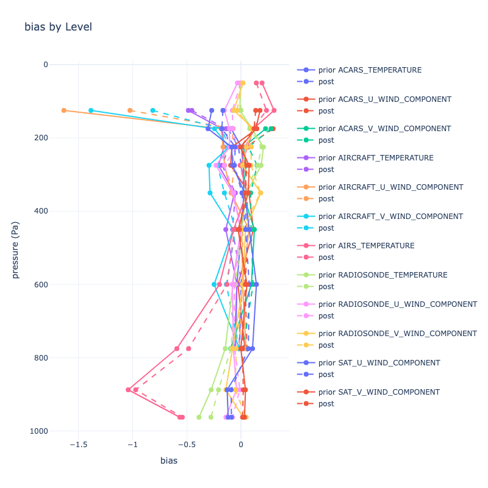

# pyDARTdiags

pyDARTdiags is a python library for obsevation space diagnostics for the Data Assimilation Research Testbed ([DART](https://github.com/NCAR/DART)).

pyDARTdiags is under initial development, so please use caution.
The MATLAB [observation space diagnostics](https://docs.dart.ucar.edu/en/latest/guide/matlab-observation-space.html) are available through [DART](https://github.com/NCAR/DART).


pyDARTdiags can be installed through pip.  We recommend installing pydartdiags in a virtual enviroment:


```
python3 -m venv dartdiags
source dartdiags/bin/activate
pip install pydartdiags
```

## Example importing the obs\_sequence and plots modules

```python
from pydartdiags.obs_sequence import obs_sequence as obs_seq
from pydartdiags.plots import plots
```

## Examining the dataframe

```python
obs_seq = obs_seq.obs_sequence('obs_seq.final.ascii')
obs_seq.df.head()
```

<table border="1" class="dataframe">
  <thead>
    <tr style="text-align: right;">
      <th></th>
      <th>obs_num</th>
      <th>observation</th>
      <th>prior_ensemble_mean</th>
      <th>prior_ensemble_spread</th>
      <th>prior_ensemble_member_1</th>
      <th>prior_ensemble_member_2</th>
      <th>prior_ensemble_member_3</th>
      <th>prior_ensemble_member_4</th>
      <th>prior_ensemble_member_5</th>
      <th>prior_ensemble_member_6</th>
      <th>...</th>
      <th>latitude</th>
      <th>vertical</th>
      <th>vert_unit</th>
      <th>type</th>
      <th>seconds</th>
      <th>days</th>
      <th>time</th>
      <th>obs_err_var</th>
      <th>bias</th>
      <th>sq_err</th>
    </tr>
  </thead>
  <tbody>
    <tr>
      <th>0</th>
      <td>1</td>
      <td>230.16</td>
      <td>231.310652</td>
      <td>0.405191</td>
      <td>231.304725</td>
      <td>231.562874</td>
      <td>231.333915</td>
      <td>231.297690</td>
      <td>232.081416</td>
      <td>231.051063</td>
      <td>...</td>
      <td>0.012188</td>
      <td>23950.0</td>
      <td>pressure (Pa)</td>
      <td>ACARS_TEMPERATURE</td>
      <td>75603</td>
      <td>153005</td>
      <td>2019-12-01 21:00:03</td>
      <td>1.00</td>
      <td>1.150652</td>
      <td>1.324001</td>
    </tr>
    <tr>
      <th>1</th>
      <td>2</td>
      <td>18.40</td>
      <td>15.720527</td>
      <td>0.630827</td>
      <td>14.217207</td>
      <td>15.558196</td>
      <td>15.805599</td>
      <td>16.594644</td>
      <td>14.877743</td>
      <td>16.334438</td>
      <td>...</td>
      <td>0.012188</td>
      <td>23950.0</td>
      <td>pressure (Pa)</td>
      <td>ACARS_U_WIND_COMPONENT</td>
      <td>75603</td>
      <td>153005</td>
      <td>2019-12-01 21:00:03</td>
      <td>6.25</td>
      <td>-2.679473</td>
      <td>7.179578</td>
    </tr>
    <tr>
      <th>2</th>
      <td>3</td>
      <td>1.60</td>
      <td>-4.932073</td>
      <td>0.825899</td>
      <td>-5.270562</td>
      <td>-5.955998</td>
      <td>-4.209766</td>
      <td>-5.105016</td>
      <td>-4.669405</td>
      <td>-4.365305</td>
      <td>...</td>
      <td>0.012188</td>
      <td>23950.0</td>
      <td>pressure (Pa)</td>
      <td>ACARS_V_WIND_COMPONENT</td>
      <td>75603</td>
      <td>153005</td>
      <td>2019-12-01 21:00:03</td>
      <td>6.25</td>
      <td>-6.532073</td>
      <td>42.667980</td>
    </tr>
    <tr>
      <th>3</th>
      <td>4</td>
      <td>264.16</td>
      <td>264.060532</td>
      <td>0.035584</td>
      <td>264.107192</td>
      <td>264.097270</td>
      <td>264.073212</td>
      <td>264.047718</td>
      <td>264.074140</td>
      <td>264.019895</td>
      <td>...</td>
      <td>0.010389</td>
      <td>56260.0</td>
      <td>pressure (Pa)</td>
      <td>ACARS_TEMPERATURE</td>
      <td>75603</td>
      <td>153005</td>
      <td>2019-12-01 21:00:03</td>
      <td>1.00</td>
      <td>-0.099468</td>
      <td>0.009894</td>
    </tr>
    <tr>
      <th>4</th>
      <td>5</td>
      <td>11.60</td>
      <td>10.134115</td>
      <td>0.063183</td>
      <td>10.067956</td>
      <td>10.078798</td>
      <td>10.120263</td>
      <td>10.084885</td>
      <td>10.135112</td>
      <td>10.140610</td>
      <td>...</td>
      <td>0.010389</td>
      <td>56260.0</td>
      <td>pressure (Pa)</td>
      <td>ACARS_U_WIND_COMPONENT</td>
      <td>75603</td>
      <td>153005</td>
      <td>2019-12-01 21:00:03</td>
      <td>6.25</td>
      <td>-1.465885</td>
      <td>2.148818</td>
    </tr>
  </tbody>
</table>
<p>5 rows × 97 columns</p>
</div>


Find the numeber of assimilated (used) observations vs. possible observations by type

```python
obs_seq.possible_vs_used(obs_seq.df)
```

<table border="1" class="dataframe">
  <thead>
    <tr style="text-align: right;">
      <th></th>
      <th>type</th>
      <th>possible</th>
      <th>used</th>
    </tr>
  </thead>
  <tbody>
    <tr>
      <th>0</th>
      <td>ACARS_TEMPERATURE</td>
      <td>175429</td>
      <td>128040</td>
    </tr>
    <tr>
      <th>1</th>
      <td>ACARS_U_WIND_COMPONENT</td>
      <td>176120</td>
      <td>126946</td>
    </tr>
    <tr>
      <th>2</th>
      <td>ACARS_V_WIND_COMPONENT</td>
      <td>176120</td>
      <td>127834</td>
    </tr>
    <tr>
      <th>3</th>
      <td>AIRCRAFT_TEMPERATURE</td>
      <td>21335</td>
      <td>13663</td>
    </tr>
    <tr>
      <th>4</th>
      <td>AIRCRAFT_U_WIND_COMPONENT</td>
      <td>21044</td>
      <td>13694</td>
    </tr>
    <tr>
      <th>5</th>
      <td>AIRCRAFT_V_WIND_COMPONENT</td>
      <td>21044</td>
      <td>13642</td>
    </tr>
    <tr>
      <th>6</th>
      <td>AIRS_SPECIFIC_HUMIDITY</td>
      <td>6781</td>
      <td>0</td>
    </tr>
    <tr>
      <th>7</th>
      <td>AIRS_TEMPERATURE</td>
      <td>19583</td>
      <td>7901</td>
    </tr>
    <tr>
      <th>8</th>
      <td>GPSRO_REFRACTIVITY</td>
      <td>81404</td>
      <td>54626</td>
    </tr>
    <tr>
      <th>9</th>
      <td>LAND_SFC_ALTIMETER</td>
      <td>21922</td>
      <td>0</td>
    </tr>
    <tr>
      <th>10</th>
      <td>MARINE_SFC_ALTIMETER</td>
      <td>9987</td>
      <td>0</td>
    </tr>
    <tr>
      <th>11</th>
      <td>MARINE_SFC_SPECIFIC_HUMIDITY</td>
      <td>4196</td>
      <td>0</td>
    </tr>
    <tr>
      <th>12</th>
      <td>MARINE_SFC_TEMPERATURE</td>
      <td>8646</td>
      <td>0</td>
    </tr>
    <tr>
      <th>13</th>
      <td>MARINE_SFC_U_WIND_COMPONENT</td>
      <td>8207</td>
      <td>0</td>
    </tr>
    <tr>
      <th>14</th>
      <td>MARINE_SFC_V_WIND_COMPONENT</td>
      <td>8207</td>
      <td>0</td>
    </tr>
    <tr>
      <th>15</th>
      <td>RADIOSONDE_SPECIFIC_HUMIDITY</td>
      <td>14272</td>
      <td>0</td>
    </tr>
    <tr>
      <th>16</th>
      <td>RADIOSONDE_SURFACE_ALTIMETER</td>
      <td>601</td>
      <td>0</td>
    </tr>
    <tr>
      <th>17</th>
      <td>RADIOSONDE_TEMPERATURE</td>
      <td>29275</td>
      <td>22228</td>
    </tr>
    <tr>
      <th>18</th>
      <td>RADIOSONDE_U_WIND_COMPONENT</td>
      <td>36214</td>
      <td>27832</td>
    </tr>
    <tr>
      <th>19</th>
      <td>RADIOSONDE_V_WIND_COMPONENT</td>
      <td>36214</td>
      <td>27975</td>
    </tr>
    <tr>
      <th>20</th>
      <td>SAT_U_WIND_COMPONENT</td>
      <td>107212</td>
      <td>82507</td>
    </tr>
    <tr>
      <th>21</th>
      <td>SAT_V_WIND_COMPONENT</td>
      <td>107212</td>
      <td>82647</td>
    </tr>
  </tbody>
</table>


## Example plotting

### rank histogram

* Select only observations that were assimliated (QC === 0).
* plot the rank histogram

```python
df_qc0 = obs_seq.select_by_dart_qc(obs_seq.df, 0) 
plots.plot_rank_histogram(df_qc0)
```


### plot profile of RMSE and Bias 

* Chose levels
* Select only observations that were assimliated (QC === 0).
* plot the profiles

```python
hPalevels = [0.0, 100.0,  150.0, 200.0, 250.0, 300.0, 400.0, 500.0, 700, 850, 925, 1000]# float("inf")] # Pa?
plevels = [i * 100 for i in hPalevels]

df_qc0 = obs_seq.select_by_dart_qc(obs_seq.df, 0)  # only qc 0
df_profile, figrmse, figbias = plots.plot_profile(df_qc0, plevels)
```




## Contributing
Contributions are welcome! If you have a feature request, bug report, or a suggestion, please open an issue on our GitHub repository.

## License

DartLabPlot is released under the Apache License 2.0. For more details, see the LICENSE file in the root directory of this source tree or visit [Apache License 2.0](https://www.apache.org/licenses/LICENSE-2.0).
