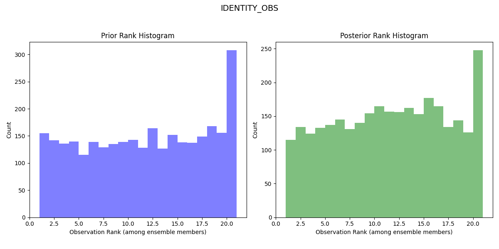

.. _dartworkflow:

=================================================================
An example of using pyDARTdiags with DART and the Lorenz 63 model
=================================================================

This page will demonstrate how to use pyDARTdiags to enhance your data assimilation projects
with DART by showing you how to manipulate DART observation sequences and analyze DART results.

We assume you have downloaded and built DART and successfully run the 
`Lorenz 63 model <https://docs.dart.ucar.edu/en/latest/guide/da-in-dart-with-lorenz-63.html>`__.

In this guide, we'll step through:

* Using pyDARTdiags to change the observations input to DART's filter program
* Using pyDARTdiags to plot rank histograms of the DART Lorenz 63 obs_seq.final files, 
  both for the original run of filter and for the run with the modified observations

Manipulating Observation Sequences with pyDARTdiags
---------------------------------------------------

This section focuses on how pyDARTdiags fits into a DART workflow, guiding you through the process
of running a Python program in an interactive session thats uses pyDARTdiags functions to read in
the observation sequence file, modify the observation error variances, and write out a new
observation sequence file with the altered data.

First, ensure you have pyDARTdiags installed in your Python environment. If you haven't
installed it yet, follow the instructions in the :ref:`installguide`.

Start an interactive Python session by entering the command ``python`` or ``python3``
in your terminal.

Enter the following lines of code one by one. You can copy and paste the code lines below, making
sure to adjust the path to your observation sequence file and file name as needed:

#. Import the necessary modules.

   .. code-block:: python

       import pydartdiags.obs_sequence.obs_sequence as obsq

#. Specify the path to and name of your observation sequence file.

   .. code-block:: python

       file_name = "/path_to_your_DART_dir/DART/models/lorenz_63/work/obs_seq.out"

#. Read the obs_seq file into an obs_seq object.

   .. code-block:: python

       obs_seq = obsq.ObsSequence(file_name)

#. Halve the observation error variances.

   .. code-block:: python

       obs_seq.df['obs_err_var'] = obs_seq.df['obs_err_var'] / 2.0

#. Create a new file name for the modified observation sequence.

   .. code-block:: python

       output_file = file_name + ".half_error_variance"

#. Write out the modified observation sequence to a new file.

   .. code-block:: python

       obs_seq.write_obs_seq(output_file)

#. Exit the interactive session.

   .. code-block:: bash

       exit()

A new observation sequence file with the modified error variances should be saved in your
current directory. The new file will have be the name of the observation sequence file you
specified with ``.half_error_variance`` appended to the end.

You can now use this new observation sequence file as input to a new DART data assimilation
experiment with Lorenz 63. Ensure you have made the necessary changes to the &filter_nml
section of the DART ``input.nml`` namelist file to point the ``obs_sequence_in_name`` namelist item
to this new input observation sequence file and give a corresponding name for the output
observation sequence file (i.e ``obs_seq.final.half_error_variance``) in the ``obs_sequence_out_name``
item. Rerun the filter program.

Analyzing DART Results with pyDARTdiags
---------------------------------------

You have now completed two DART data assimilation experiments, each producing an
final observation sequence file, or ``obs_seq.final``. This file contains the actual
observations as assimilated as well as the ensemble forward-operator expected values
and any quality-control values.

You can now use the pyDARTdiags library to read in and analyze the observation
space results of your DART assimilation experiment. In this example, we'll plot the
 :ref:`stats-rank-hist` of the DART Lorenz 63 obs_seq.final files.

The observation sequence files you created for Lorenz 63 contain only identity
observations. You can read about identity observations in
`this section <https://ncar.github.io/pyDARTdiags/userguide/working-with-obsq.html#a-note-on-identity-observations>`__
of the pyDARTdiags documentation.

Identity observations do not get listed in the header of the observation sequence file; they
are instead given a special value for the observation type (kind) in the observation sequence
to indicate that they are identity observations. They are denoted in a given observation by an
observation type of -x where x is the index in the DART state vector that the observation
corresponds to.

In the ObsSequence DataFrame, the type of identity observations is stored as this negative integer
of the index in the DART state vector. Therefore, when writing the program to plot the rank
histograms, you will specify the observation type as ``IDENTITY_OBS``.

Start an interactive Python session by entering the command ``python`` or ``python3``
in your terminal.

Enter the following lines of code one by one. You can copy and paste the code lines below, making
sure to adjust the path to your observation sequence file and file name as needed:

#. Import the obs_sequence module.

   .. code-block:: python

       import pydartdiags.obs_sequence.obs_sequence as obsq

#. Import the matplots module.

   .. code-block:: python

       import pydartdiags.matplots.matplots as mp

#. Specify the path to and name of the final observation sequence file from
   your first DART data assimilation experiment.

   .. code-block:: python

       file_name = "/path_to_your_DART_dir/DART/models/lorenz_63/work/obs_seq.final"

#. Specify the path to and name of the final observation sequence file from
   your second DART data assimilation experiment.

   .. code-block:: python

       file_name2 = "/path_to_your_DART_dir/DART/models/lorenz_63/work/obs_seq.final.half_error_variance"
       

#. Read the first observation sequence file into an obs_seq object.

   .. code-block:: python

       obs_seq = obsq.ObsSequence(file_name)

#. Read the second observation sequence file into an obs_seq object.

   .. code-block:: python

       obs_seq_half_ev = obsq.ObsSequence(file_name2)

#. Choose an observation type to plot on the rank histograms.

   .. code-block:: python

       obs_type = "IDENTITY_OBS"

#. Set the ensemble size used in your DART experiments.
   For the Lorenz 63 model, the default ensemble size is 20.

   .. code-block:: python

       ens_size = 20

#. Plot the rank histograms for the first obs_seq.final.
   The dataframe has prior and posterior information so both the prior and posterior rank
   histograms are plotted.

   Once plotted, save the figure and close it. 

   .. code-block:: python

       fig = mp.plot_rank_histogram(obs_seq, obs_type, ens_size)

#. Plot the rank histograms for the second obs_seq.final with halved error variance.

   Once plotted, save the figure and close it. 

   .. code-block:: python

       fig2 = mp.plot_rank_histogram(obs_seq_half_ev, obs_type, ens_size)

#. Exit the interactive session.

   .. code-block:: bash

       exit()

You should now have rank histogram plots for both experiments and can now compare the two 
to see how the change in observation error variances affected the results of your data
assimilation experiments. Look for differences in the shape of the histograms, which supply
information on the model bias. The results should look like similar to the images below.

Rank Histogram for First Lorenz 63 Experiment:

Rank Histogram for Second Lorenz 63 Experiment with Halved Error Variance:

.. image:: ../images/rh_l63_halfev.png
   :alt: Rank Histogram for Second Lorenz 63 Experiment with Halved Error Variance
   :width: 800px
   :align: center

The rank histogram for the initial experiment should be generally flatter and more evenly spread
across the ranks, indicating a more reliable forecast (the observed distribution is well represented
by the ensemble and all ensemble members represent equally likely scenarios).

By following this workflow, you have learned how pyDARTdiags can be easily integrated into your
DART data assimilation experiments, allowing you to effectively manipulate observation sequences
and analyze assimilation results. Please refer to the :ref:`userguide` and
:ref:`examples-index` sections of the documentation for more detailed information and additional
examples of using pyDARTdiags.